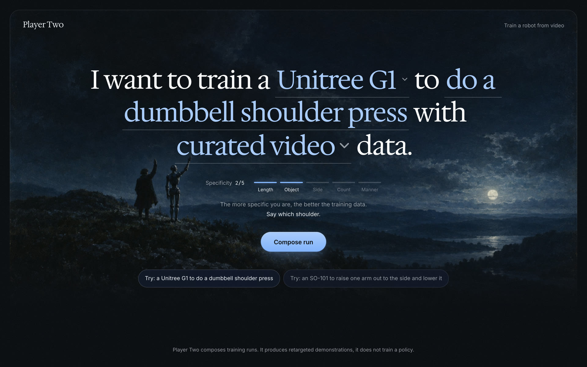
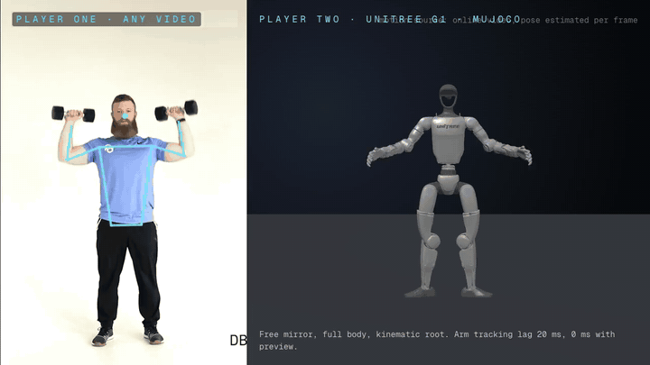
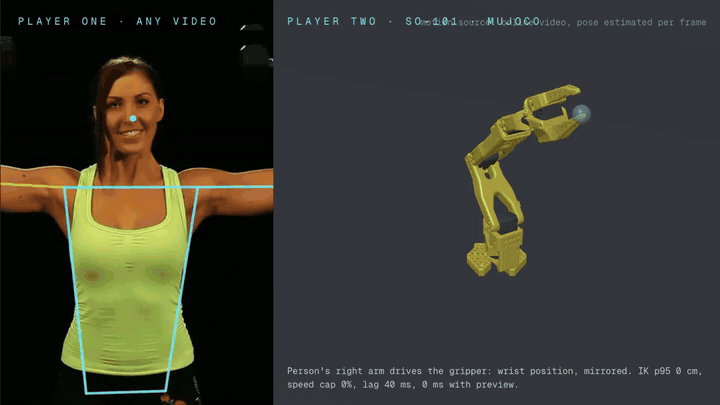
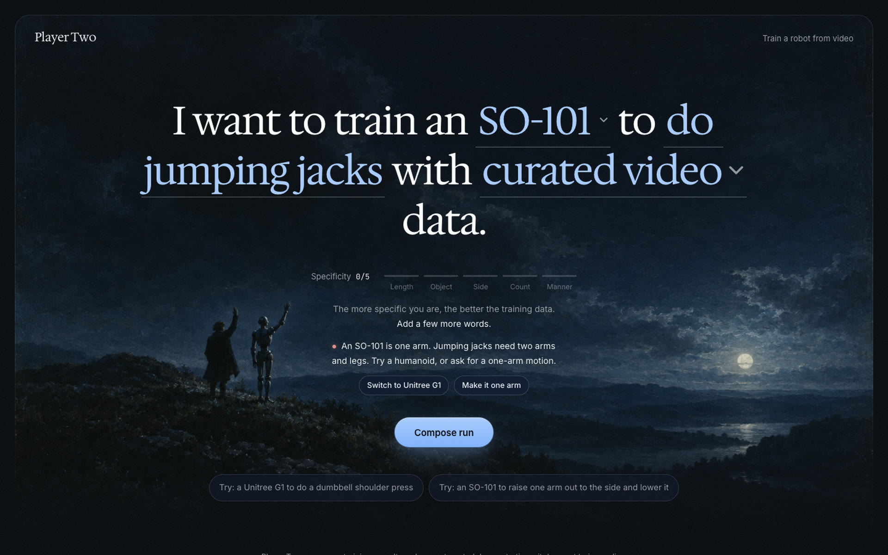
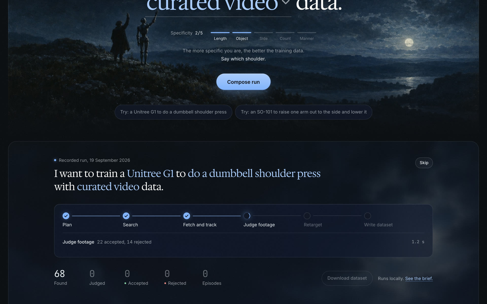
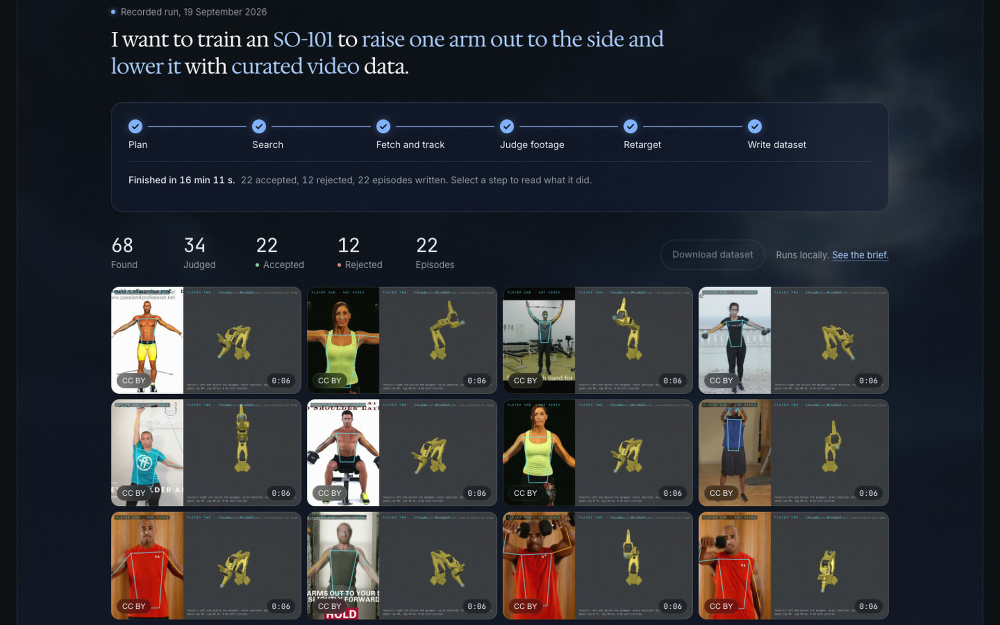
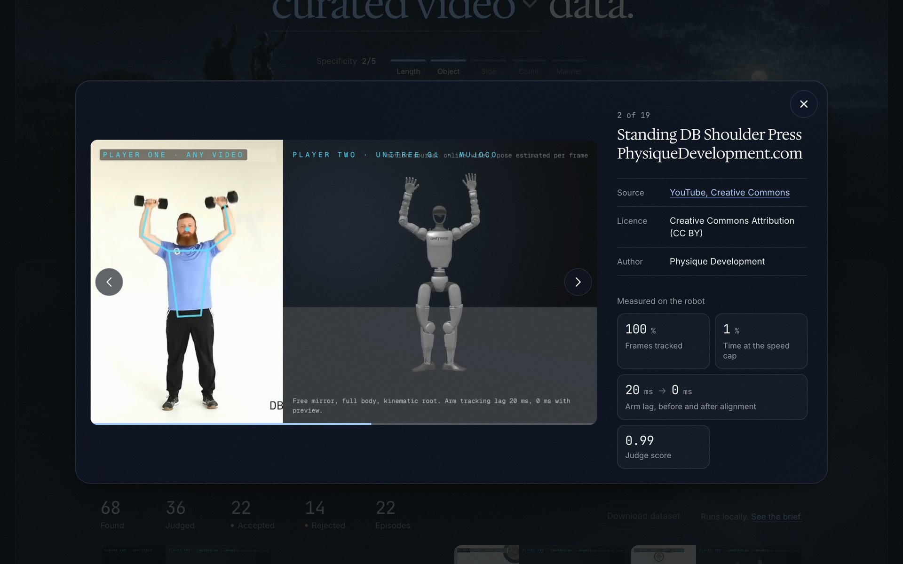
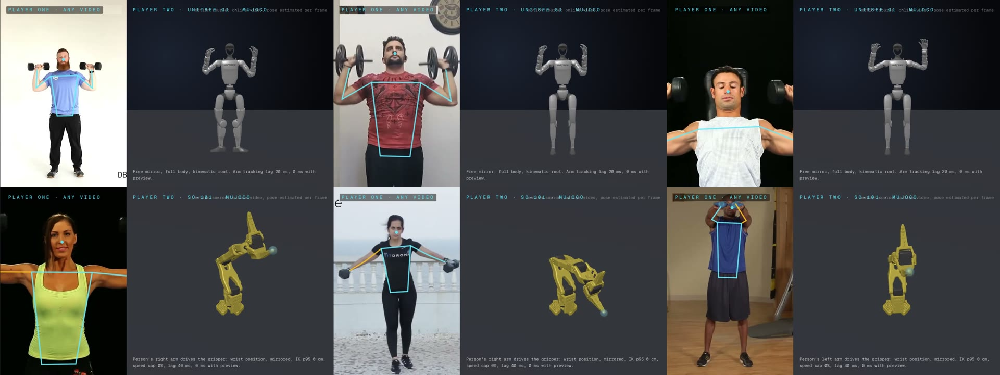
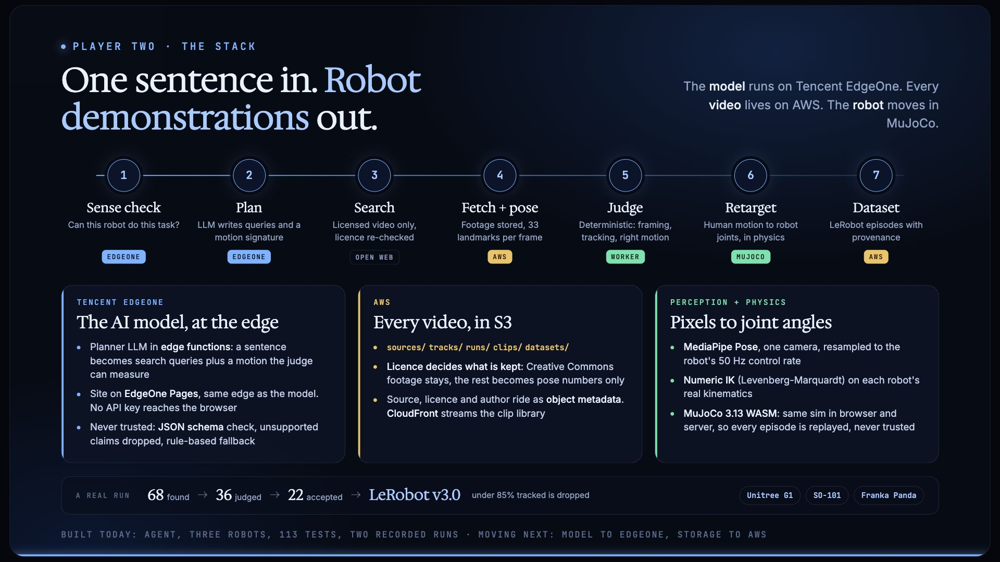

<div align="center">

<a href="https://player-two-site.vercel.app"></a>

# 🎮 Player Two

### One sentence in. Robot demonstrations out.

**An AI agent that finds licensed video of people doing a task and turns it into<br>physics-checked training demonstrations for real robot models.**

<br>

[](https://player-two-site.vercel.app)
[](https://player-two-site.vercel.app/media/player-two-demo.mp4)
[](https://player-two-deck.vercel.app)
[](https://player-two-stack.vercel.app)


<sub>Built at the Executable World hackathon, San Francisco, 19 September 2026</sub>

</div>

<br>

## 👀 See it move

<table>
<tr>
<td width="50%" align="center"><br><b>Unitree G1</b> · "do a dumbbell shoulder press"</td>
<td width="50%" align="center"><br><b>SO-101</b> · "raise one arm out to the side and lower it"</td>
</tr>
</table>

<div align="center"><sub>Left of each clip: a Creative Commons video the agent found on its own. Right: the robot in MuJoCo, driven by that person's motion.</sub></div>

<br>

## 💡 Why

Robot foundation models are short of **demonstrations**, not architectures. Collecting them today means a person teleoperating a robot by hand, one episode at a time. Meanwhile the internet already holds millions of videos of people doing the exact tasks we want robots to learn.

**Player Two turns that footage into robot training data, with no human in the loop.**

<br>

## ⚙️ How it works

```mermaid
flowchart LR
    S(["💬 One sentence"]):::in --> A["1 · Sense check<br/><i>can this robot do it?</i>"]:::edge
    A --> B["2 · Plan<br/><i>LLM: queries + motion signature</i>"]:::edge
    B --> C["3 · Search<br/><i>licensed video only</i>"]:::web
    C --> D["4 · Fetch + pose<br/><i>33 landmarks per frame</i>"]:::aws
    D --> E["5 · Judge<br/><i>deterministic, most is rejected</i>"]:::sim
    E --> F["6 · Retarget<br/><i>IK inside MuJoCo physics</i>"]:::sim
    F --> G[("7 · LeRobot v3.0<br/>dataset + provenance")]:::aws

    classDef in fill:#eaf1ff,stroke:#7fb2ff,color:#05101f,stroke-width:2px
    classDef edge fill:#7fb2ff,stroke:#2b5fb8,color:#05101f,stroke-width:2px
    classDef web fill:#1b2540,stroke:#93a3c4,color:#eaf1ff,stroke-width:2px
    classDef aws fill:#e9c46a,stroke:#b8860b,color:#1d1300,stroke-width:2px
    classDef sim fill:#7fe0b0,stroke:#1f9d63,color:#04150d,stroke-width:2px
```



| | Step | What happens |
|---|---|---|
| 🧠 | **Sense check** | A one-arm SO-101 asked to do jumping jacks is refused before anything is searched, with a suggestion: switch to a humanoid, or ask for a one-arm motion. |
| 📝 | **Plan** | An LLM writes search queries and a motion signature the judge can measure. Its output must match a JSON schema, unsupported claims are dropped, and a rule-based planner takes over if the model fails. |
| 🔎 | **Search** | Creative Commons video only. The licence is re-checked from each video's own metadata. Bot checks and refusals are never worked around. |
| 🕺 | **Fetch + pose** | MediaPipe Pose tracks the person in every frame. Footage that may not be redistributed is reduced to pose numbers and deleted. |
| ⚖️ | **Judge** | Deterministic: framing, one continuous person, tracked frames, the planned motion and its direction. Most video is rejected. That is the product. |
| 🤖 | **Retarget** | Numeric inverse kinematics maps human motion onto the robot's real kinematics inside MuJoCo. Episodes the robot followed for under 85% of the clip are dropped. |
| 📦 | **Dataset** | LeRobot v3.0 episodes, written through the LeRobot library and loaded back as a check, with source, licence and author on every episode. |

<br>

## 📊 A real run

<div align="center">

| 🔍 Found | ⬇️ Judged | ✅ Accepted | 📼 Episodes | ⏱ Time | 🙋 Humans |
|:---:|:---:|:---:|:---:|:---:|:---:|
| **68** | **36** | **22** | **22** | **16 min 46 s** | **0** |

<sub>"Unitree G1, dumbbell shoulder press". Every number on the site comes from the run's own trace in <code>data/runs/</code>.</sub>

</div>

<br>

## 🖥 The site

**Type one sentence.** Pick a robot, describe the task, choose a data tier. The more specific you are, the better the training data.

<table>
<tr>
<td width="50%"><br><sub><b>It knows what a robot can do.</b> An SO-101 is one arm, so jumping jacks are refused with two one-click fixes.</sub></td>
<td width="50%"><br><sub><b>The run, step by step.</b> Plan, search, fetch and track, judge, retarget, write dataset.</sub></td>
</tr>
<tr>
<td width="50%"><br><sub><b>A clip library</b> of every accepted episode: hover to peek and scrub, click to open.</sub></td>
<td width="50%"><br><sub><b>Provenance on every clip:</b> source, licence, author, frames tracked, lag, judge score.</sub></td>
</tr>
</table>



<br>

## 🧱 The stack

<a href="https://player-two-stack.vercel.app"></a>

| Layer | What | Status |
|---|---|---|
| 🟦 **Model** | Planner LLM served from **Tencent EdgeOne** edge functions, site on EdgeOne Pages | 🔜 moving next (today: Gemini, called server-side) |
| 🟨 **Storage** | All footage, pose tracks, clips and datasets in **AWS S3** behind CloudFront | 🔜 moving next (today: local disk) |
| 🟩 **Perception** | MediaPipe Pose, zero-phase smoothing, resampled to 50 Hz | ✅ built |
| 🟩 **Physics** | MuJoCo 3.13 WASM, same simulation in browser and Node, server replays every episode | ✅ built |
| 🟩 **Retargeting** | Levenberg-Marquardt IK, one retargeter per embodiment | ✅ built |
| 🟩 **Output** | LeRobot v3.0 with per-episode provenance | ✅ built |
| ⬜ **Frontend** | Next.js 16 app (operator page, dataset wall, live agent page) plus a static public site | ✅ built |

<br>

## 🤖 Robots

| | Robot | Model | How it follows a person |
|---|---|---|---|
| 🦿 | **Unitree G1** | MuJoCo Menagerie | Arms, legs and pelvis. Legs are held when the person is seated. |
| 🦾 | **SO-101** | TheRobotStudio official MJCF | One human wrist, relative to the shoulder and scaled to the arm's workspace, drives the gripper position. |
| 🦾 | **Franka Panda** | MuJoCo Menagerie | Same mapping. Its real 2.175 rad/s limit decides what footage it can follow. |

<br>

## 🚀 Quick start

```bash
pnpm install
pnpm dev --port 3218          # operator page at /, dataset wall at /wall, agent at /agent

# run the agent: a task in plain words in, a traceable set of demonstrations out
pnpm dlx tsx scripts/agent/agent.mts "dumbbell shoulder press" --robot g1 \
  --max-videos 70 --target-accepted 22 --seconds 6 --sources youtube-cc

pnpm test                     # 113 tests against real MuJoCo
```

The planner reads `GEMINI_API_KEY` from the environment. Without one it falls back to a rule-based plan. Pose extraction needs `uv` and `yt-dlp`.

📚 **Full technical reference:** [docs/REFERENCE.md](docs/REFERENCE.md) (gates, agent internals, feasibility rules, embodiments, export)

<br>

## 🧭 Honest limits

- The output is **kinematic demonstrations**. No policy is trained yet.
- The **gripper never closes** from video. Body pose alone cannot tell an open hand from a fist; that needs hand tracking.
- Wrist orientation is not retargeted. Depth from a single camera is the noisy axis.
- The G1's pelvis is a kinematic root: it follows the person, it is not balanced by a controller.
- The live webcam path has not been tested with a real camera in a room yet.

<br>

## 📜 Credits and licences

Robot models: [Unitree G1](vendor/unitree_g1/LICENSE) and [Franka Panda](vendor/franka_emika_panda/LICENSE) from MuJoCo Menagerie, [SO-101](vendor/so101/LICENSE) from TheRobotStudio. Every source video shown is Creative Commons (CC BY), with its author and link recorded in the run trace and shown in the clip viewer.

<div align="center">
<br>

**Built by [Pranav Achar](https://github.com/PranavAchar01) and [Nithin Aruswamy](https://github.com/nithinaru)**

[](https://player-two-site.vercel.app)

</div>
